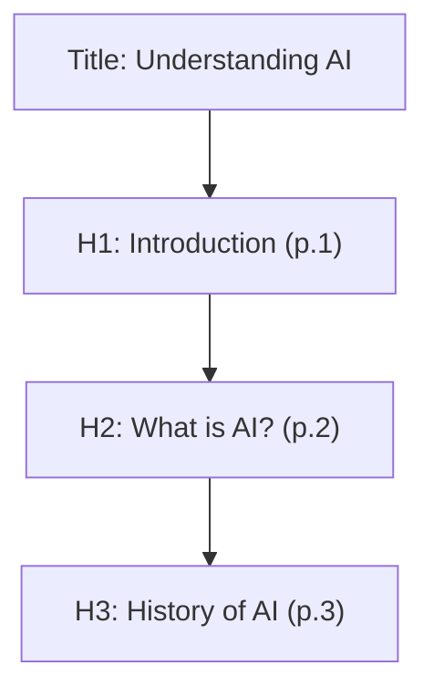

# Challenge 1A: PDF Outline Extractor


## Overview

This project is a solution for **Round 1A: Understand Your Document** from the Adobe India Hackathon 2025. The goal is to process PDF documents and extract a structured outline, including:

- **Title**
- **Headings at levels:** H1, H2, H3 (with page numbers)

The output is a clean, hierarchical JSON structure suitable for downstream tasks like semantic search and intelligent document processing.

---

## Features

- **Automatic PDF scanning** in `/app/input`
- **Heading extraction** with levels and page numbers
- **JSON output** in `/app/output`
- **Containerized** with Docker
- **Offline, AMD64 compatible**

---

## Directory Structure

```plaintext
Challenge_1a/
├── app/
│   ├── input/          # Input PDFs (mounted as /app/input)
│   └── output/         # Output JSONs (mounted as /app/output)
├── src/
│   ├── extractor.py     # Main runner script
│   ├── pdf_utils.py     # Text extraction logic using PyMuPDF
│   └── heading_utils.py # Heading classification logic
├── requirements.txt     # Python dependencies
├── Dockerfile           # Docker container definition
└── README.md            # Project documentation (this file)
```

---

## Approach

- **PDF Parsing:** Uses PyMuPDF (`fitz`) for fine-grained text and metadata extraction.
- **Heading Classification:** Heuristics analyze font size, position, and style for H1/H2/H3.
- **Output:** Hierarchical JSON with level, text, and page number.

### Example Outline Diagram



---

## Input Format

Place one or more PDF files inside the `app/input/` folder (mounted as `/app/input` in the container).

---

## Output Format

Each `filename.pdf` produces a `filename.json`:

```json
{
  "title": "Understanding AI",
  "outline": [
    { "level": "H1", "text": "Introduction", "page": 1 },
    { "level": "H2", "text": "What is AI?", "page": 2 },
    { "level": "H3", "text": "History of AI", "page": 3 }
  ]
}
```

---

## Build Instructions

```bash
docker build --platform=linux/amd64 -t pdf-outline-extractor:latest .
```

---

## Run Instructions

```bash
docker run --rm \
  -v $(pwd)/app/input:/app/input \
  -v $(pwd)/app/output:/app/output \
  --network none \
  Challenge_1a:latest
```

_On Windows PowerShell, use `${PWD}` or absolute paths as needed._

---

## Expected Execution Behavior

- Processes all `.pdf` files from `/app/input`
- Generates corresponding `.json` files in `/app/output`
- No network access required
- Finishes within 10 seconds for 50-page PDFs
- CPU only, <200MB model size

---

## Dependencies

Installed via `requirements.txt`:

```ini
pymupdf==1.22.5
```

---

## Constraints Met

| Constraint     | Status           |
| -------------- | ---------------- |
| Execution Time | ≤ 10s / 50 pages |
| Model Size     | ≤ 200MB (N/A)    |
| Network Access | None required    |
| Platform       | AMD64 (x86_64)   |
| Runtime        | CPU only         |

---

## Validation Checklist

- All PDFs processed automatically
- Output matches expected schema
- Output saved as `filename.json` in `/app/output`
- No external internet usage
- Compatible with Docker on AMD64
- Runs under resource limits (8 CPU / 16 GB RAM)

---

## Pro Tips / Notes

- Heading detection uses font, spatial, and style features (not just font size).
- Modular code: `pdf_utils.py` for extraction, `heading_utils.py` for heading logic.
- Well-suited for extension in future rounds.

---

## Authors

**Rajat Bhati**  
[Your LinkedIn / GitHub if submitting]
**Yash Mittal**
[Your LinkedIn / GitHub if submitting]
**Harshal Vilas Relan**
[Your LinkedIn / GitHub if submitting]
